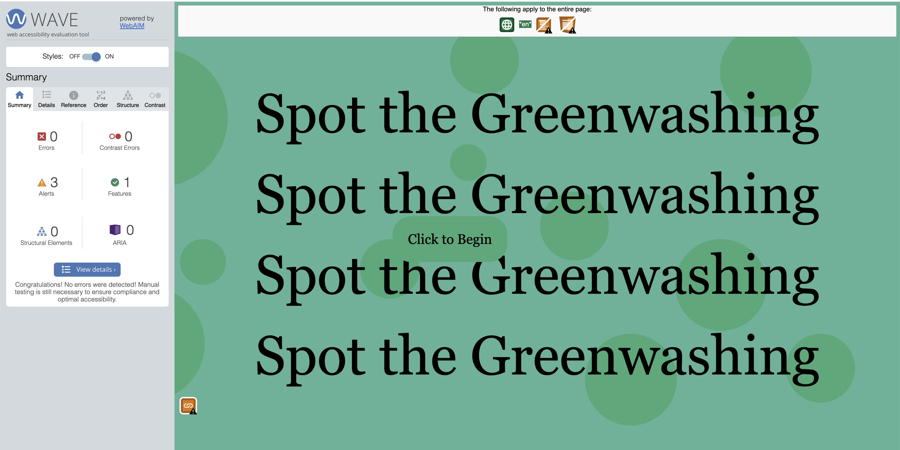
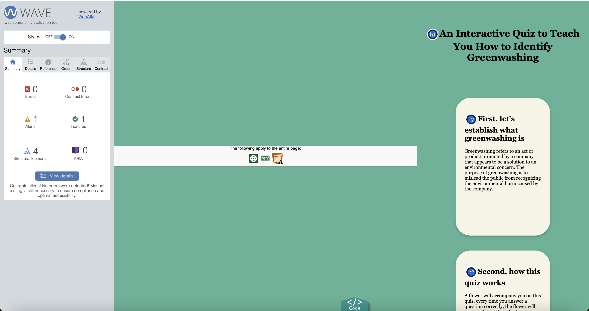
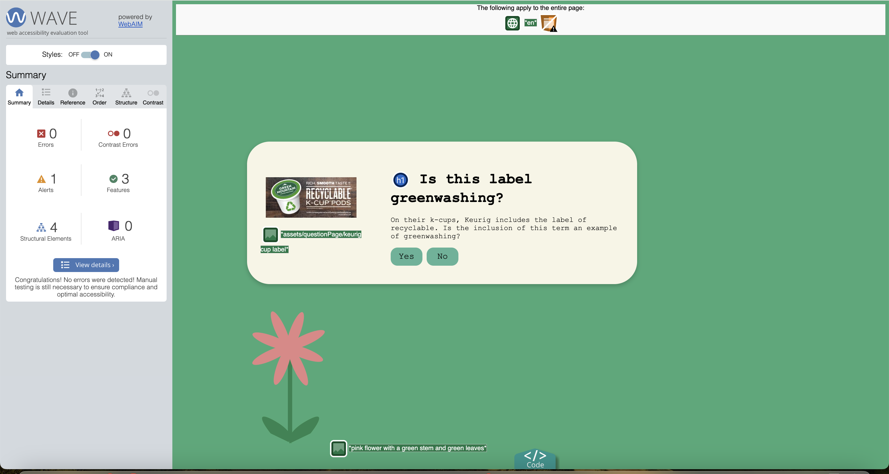
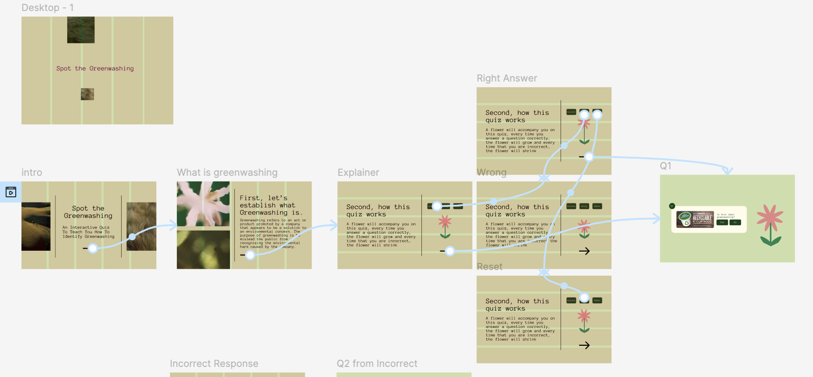
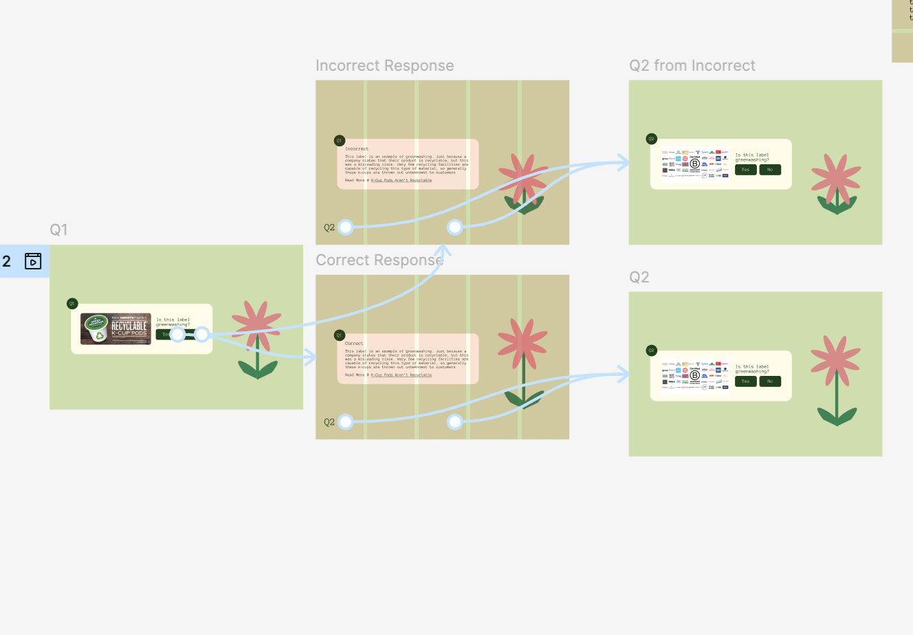
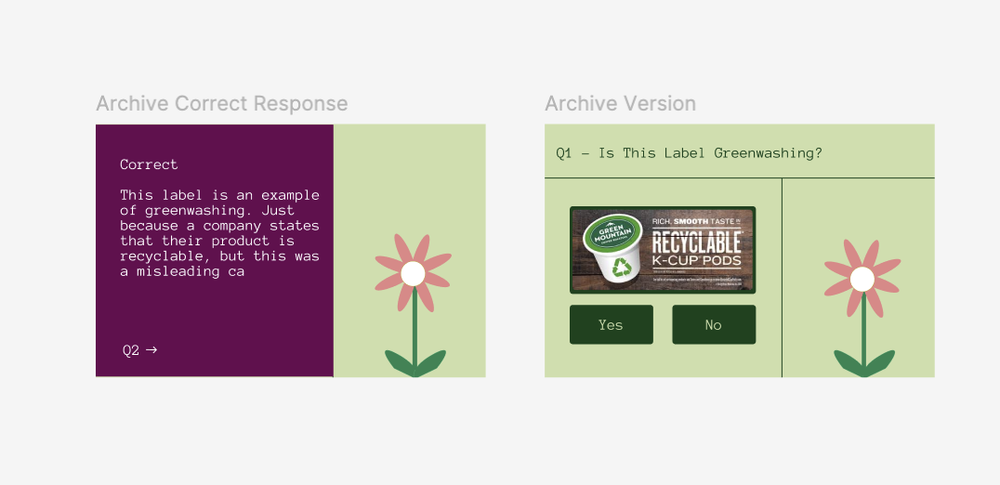
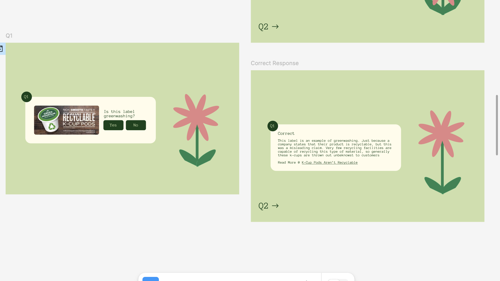
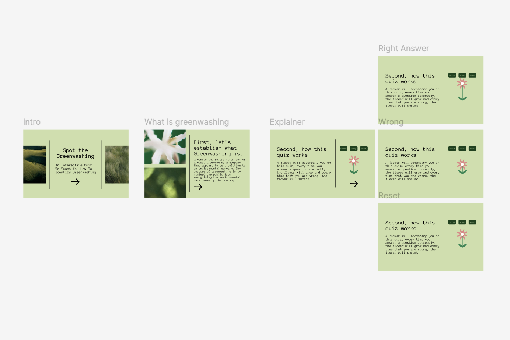
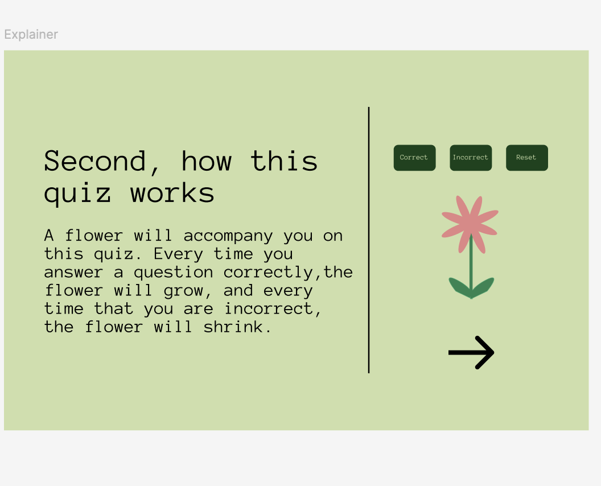
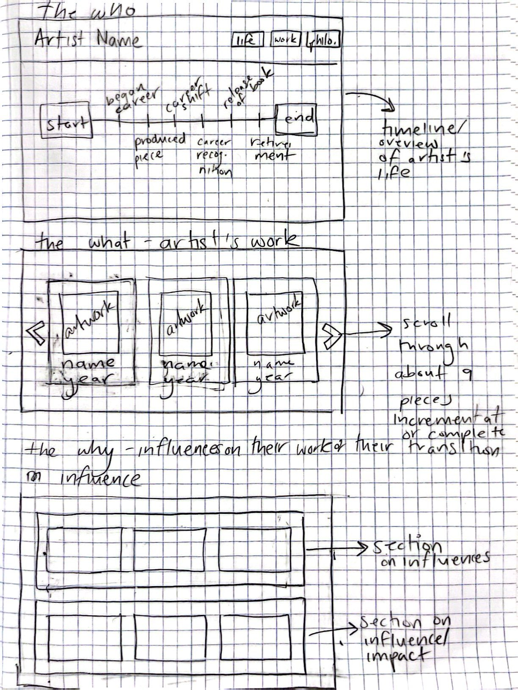

# Final Project

<mark>**Note that this document order from FP4 -> FP1**</mark>

# **Accessibility and Responsiveness**

## Part 1: Accessibility

## Part 2: Responsiveness

My webpageis responsive to a macbook air display and an iPad Air

# **FP4 \- Final Project Writeup**

Feel free to refer to this [Markdown Cheat Sheet](https://www.markdownguide.org/cheat-sheet/) to make your writeup more organized, and you can preview your markdown file in VSCode [Markdown editing with Visual Studio Code](https://code.visualstudio.com/docs/languages/markdown#_markdown-preview).

## Part 1: Website Description

Describe your website (300 words).
The purpose of my website is teach about what greenwashing is and how to identify greenwashing. I want to teach individuals about this issue as a way to ensure that they are empowered to make more climate-conscious decisions. Because as consumers, we have very little control over the environmental practices and impact of companies. However, where we choose to spend our money yields some limited influence on however companies act.
My target audience are individuals who are trying to become more aware about making environmentally-conscious choices or indivduals who are trying to ensure that their current understanding of greenwashing is accurate. Along with individuals who might need a refresher on greenwashing.
I want to convey to individuals the pervasiveness of greenwashing and how it can difficult to identify. I want individuals to gain a sort of skepticism towards companies and the claims they make. Hopefully, they can use this information to make act as eco-conscious as posible
My website is engaging as it will demonstrate to individuals just how misleadings companies can be and will teach them a new skill: identifying greenwashing.

- What is the purpose of your website?
- Who is the target audience?
- What information do you convey with your website?
- How is it interesting and engaging?

## Part 2: User Interaction

How a user would interact with your website? For each step, briefly but clearly state the interaction type & how we should reproduce it.

Home Page

1. Click to begin

Instructions Page

1. Reading through the defintion of greenwashing
2. reading through the background on the game
3. Click begin button to begin

Quiz

1. Read through question and click on answer
2. Read through explainer and click the button to go to the next question
3. Read through question and click on answer
4. Read through explainer and click the button to go to the next question
5. Read through question and click on answer
6. Read through explainer and click the button to go to the next question
7. Read through question and click on answer
8. Read through explainer and click the button to go to the next question
9. Click on resource links

## Part 3: External Tool

Describe what important external tool you used (JavaScript library, Web API, animations, or other). Following the bulleted list format below, reply to each of the prompts.

1. GSAP

- I chose GSAP because it the was option I checked out and when it was able to perform the way I wanted it to perform, I had no need to pursue other options.

- I used it to make the flower shrink and grow in response to a user's accuracy in answering a question

- it's add a more playful element to the quiz and makes the feel user more intentional with their answers in order to make their flower grow rather than shrink

## Part 4: Design Iteration

I changed the home page and instruction page of my prototype. I wanted to have a more on the nose design for my homepage so I added a dotted background that replaced my original background which was pictures of flowers.

I changed my instructions to just be one to minimize how much a user has to click through.

## Part 5: Implementation Challenge

I had challenges with my css not being updated to my deployed website and troubleshooting to figure out why. I had trouble formatting with CSS and getting things to somewhat look how I wanted them to. I struggled to download GSAP because I initially tried to use npm but that didn't installed correctly and complicated the process.

## Part 6: Generative AI Use and Reflection

I used Chat GPT for debugging mainly and for more direct answers on how to something. I would ask Chat GPT to look at my code to my sure my syntax was not off. I would ask ChatGPT questions such as how to make a page responsive or how to make a circle just very simple stuff. I asked ChatGPT with formatting help on how to center things, as I find this stuff to be very difficult and appreciate having the help.

### Usage Experiences by Project Aspects

Feel free to edit the column \_ (other?) or add more columns if there's any other aspect in your project you've used the GenAI tools for.

For the following aspects of your project, edit the corresponding table cell to answer:

- _Usage_: Whether you used / did not use this tool for the aspect. Enter [Yes/No]
- _Productivity_: Give a rating on whether this tool makes your productivity for X aspect [1-Much Reduced, 2-Reduced, 3-Slightly Reduced, 4-Not Reduced nor Improved, 5-Slightly Improved, 6-Improved, 7-Much Improved].

| Tool Name | Ratings      | design | plan | write code | debug | \_ (other?) |
| :-------- | :----------- | :----- | :--- | :--------- | :---- | :---------- |
| ChatGPT   | Usage        | Yes    | Yes  | No         | Yes   | Yes         |
| ChatGPT   | Productivity | 5      | 5    | 4          | 5     | 5           |

### Usage Reflection

> Impact on your design and plan
> I

- It matched my expectations and plan in [FP2](#generative-ai-use-plan) in that … For example,
  1. Tool1:ChatGPT
     I expected that I would ChatGPT for simple how-to's as I liked how it was so direct in giving an answer. When you look at pages like Stack Overflow. The answer you can be looking for can be buried or not even there. ChatGPT just streamlines the process for me and takes care of the little simple things, so I can focus on other stuff.

> Use patterns

- I accepted the generations when … For example,

  1.ChatGPT: suggested a new method for centering my content and I accepted it, because it actually worked unlike the code I had been implementing.

- I critiqued/evaluated the generated suggestions by … For example,
  1. ChatGPT: For debugging this tool did not always have the best answers when issues became more complexed or nuanced, it just had a prescribed script of clear you cache and other such measures (Referring to my issue with my CSS not updating in my deployed website). I indicated that this didn't work but it still suggested this resolution.

> Pros and cons of using GenAI tools
> ChatGPT

- Pros
  1.faster 2. for simple stuff there is very little room for error
- Cons
  1. lacks nuance
  2. can be repititive and struggle to generate new solutions

### Usage Log

Document the usage logs (prompts and chat history links) for the GenAI tools you used. Some tools may not have an easy way to share usage logs, just try your best! Some instructions for different tools:

1. [ChatGPT]
   https://chatgpt.com/share/6758f80c-37b4-8008-8320-7127a42af785
   https://chatgpt.com/share/6758f874-6b78-8008-aff2-49dc0b54f8c6
2. [GitHub Copilot (VSCode)](
   n/a

<https://code.visualstudio.com/docs/copilot/copilot-chat#:~:text=You%20can%20export%20all%20prompts%20and%20responses%20for%20a%20chat%20session%20in%20a%20JSON%20file%20with%20the%20Chat%3A%20Export%20Session...%20command%20(workbench.action.chat.export)%20in%20the%20Command%20Palette.>): export chat histories relevant to this project.

---

# **FP3 \- Final Project Check-in**

Document the changes and progress of your project. How have you followed or changed your implementation & GenAI use plan and why? Remember to commit your code to save your progress.

## Implementation Plan Updates

- [ ] ...

## Generative AI Use Plan Updates

- [ ] ...

Remember to keep track of your prompts and usage for [FP4 writeup](#part-6-generative-ai-use-and-reflection).

---

# **FP2 \- Evaluation of the Final project**

## Project Description

My project will be an interactive quiz on greenwashing. My motivation for this project arose from my own investment in environmental concern/issues. It is very easy for companies to present misleading environmental claims so I want to educate people on how to identify misleading claims which is greenwashing.

## High-Fi Prototypes

### _Prototype 1_

The user feedback for this prototype was helpful, positive, and constructive. Users noted that they enjoyed the color palette and the overall aesthetic of the website. Users were also enthusiatic about the growing flower component, which was reassuring to hear confirmation that the flower was engaging. Notes on word choices (wrong vs incorrect) and font sizes further aided in my design.

### _Prototype 2_

The user feedback for this prototype was helpful, positive, and constructive. Users found the quiz straightforward to engage with and found the background information to be helpful/educating. User 1 noted that they understand that I was trying to achieve a minimalist aesthetic but was not quite achieving it on my first round. They provided helpful critiques to actually achieve this goal.

## Usability Test

The user feedback I received during both of my usability tests were incredibly helpful. One reassuring component was that none of my users were confused by how to interact with the quiz. Because my quiz is very straightforward and simple in design, having any source of confusion can be a major bottleneck and greatly impact the user experience.

My users were able to provide me with positive reassurance along with helpful feedback on how I could improve. User 1 provided me with great insights on how to improve my design. They suggested that I should change the layout for q section and to use a card instead of the line segmenting I was doing to create a more minimalist layout. Upon receiving their feedback, I realized that I should have not created a new layout for the feedback component of the quiz and realized that it made more sense to use the same format for the sake of consistent (the other layout just looked random).

I did not implement all of User 1's suggestion on text size. They informed me that size 16 was general the web standard. I found that using this size on components such as the intro page, the greenwashing definition page, and the instruction page would have resulted in an unbalanced composition. The small size of the text would result in the paragraphs looking disproportionate. I did not want to write long paragraphs, as a way to aid user engagement and decrease cognitive load, and this would have be the avenue to pursue for restoring the balance of the page.

User 2 provided helpful feedback on the emotional response of using the quiz. They found the experience to be soothing due to the chosen images and color palette.

User 2 helped me to make edits to the text component of the instructions. They truncated sentences which I believe is advantageous for the design as it is more cumbersome for the user to read longer sentences. They reassured me on the definition of greenwashing and noted that they found it to be helpful. Though do to this user's familiarity with environmental issues, I do aim to seek feedback on this definition for individuals who are less aware on environmental issues.

User 2 suggested that I should shrink the images on the definition page. I did intitially test out this suggestion, but decided to stick with it. I did not find that it help to enhance the overall page and thought it looked awkward compared to the original design.

Overall, I found my user studies to be incredibly helpful.

## Updated Designs

My layout was completely revamped. I removed the line as User 1 believed that it did not add anything to the overall layout. I created a card for the Q1 layout as User 1 noted that this might help me to create a more minimalist design. I change the designation of question for a landing to being a shorthand in an ellipse for a more minimalist design. I changed the card on the feedback page from purple to beige as User 2 noted that they found the purple color to be harsh and agreesive. I made my buttons smaller as the user noted that my text was too big. I made the layout for the feedback (page that informs you whether correct or incorrect) to be the same as the q page layouts to create a more streamlined and consistent look.

I changed the text content on the instruction component of prototype 1. User 1 noted that the word choice "wrong" was harsh, we decided to change it to "incorrect." They noted that they enjoyed the animation component of the flower. The text component was edited to be more concise and to get rid of grammatical errors (missing commas and periods).

## Feedback Summary

The feedback in the lab session was for when I was pursuing another project idea. Therefore, I do not have entirely relevant feedback for this project. It is relevant in some capacity, as receiving this feedback made me realize that I should pursue another topic.

This was because while I was receiving feedback for my old project, which was a skincare quiz for establishing a routine, I realized how little excitement I had for that project. Any positive reinforcement or helpful pivots I received had very little impact on me. I was not eager to implement them or I did not feel validated by positive comments. I decided it would be best to change my project to another topic that would excite me more.

I want to be excited by my topic as this will allow me to feel motivated while I am facing the inevitable bugs and technical issues that will come with working on this project. Because we have not actually started coding for this project, this is final point at which I could possible change my project.

The experience of working on my new prototype for my new project idea validated my decision. I already felt more engaged with the process.

## Milestones

### _Implementation Plan_

- [x] Week 9 Oct 28 \- Nov 3:
  - [x] FP1 due
  - [x] perform necessary background research on greenwashing topic
  - [x] Write quiz q's and instructions
- [ ] Week 10 Nov 4 \- Nov 8:
  - [x] Research which libraries to use
  - [x] FP2 due
  - [ ] Create the baseline of the website
    - [ ] creating the intro, definition, and instruction pages
    - [ ] creating the pages for the five q's
    - [ ] creating the result page
- [ ] Week 11 Nov 11 \- Nov 15:
  - [ ] make relevant design adjustments to page
  - [ ] Store questions in a JSON
  - [ ] Create basic form inputs
  - [ ] Decide on a library
  - [ ] working and troubleshooting with chosen library
  - [ ] do an accessibility check-in with TA or prof to ensure page is compliatn
- [ ] Week 12 Nov 18 \- Nov 22:
  - [ ] editing the design and layout of the website as needed
  - [ ] continue implementing relevant features
- [ ] Week 13 Nov 25 \- Nov 29:
  - [ ] perform usability tests
  - [ ] make relevant adjustments in accordance to findings
  - [ ] Thanksgiving
- [ ] Week 14 Dec 2 \- Dec 6:
  - [ ] perform usability tests
  - [ ] make relevant adjustments in accordance to findings
  - [ ] FP4 due

### _Libraries and Other Components_

List the JS libraries and other components (if applicable) that you plan to use.

- I will either be using the GSAP library or the Anime.js library

## Generative AI Use Plan

I will be using ChatGPT similar to a TA to aid in my troubleshooting and debugging. I will look to it for suggestions on how to implement certain features such as using my chosen library to generate animations.
I will use ChatGPT to examine the logic of my code. By having it outline what my code is currentlyd doing, this will help me to know what adjustments I need to make to ensure I am actually achieving what I set out to achieve.

### _Tool Use_

ChatGPT
I will use ChatGPT for text editing, as it can be helpful for grammar.
I will also use ChatGPT

- ChatGPT
  - I will use it for … because it can help me …
  - I will not use it for … because it might not be able to help me with …
- GitHub Copilot
- ...

### _Responsible Use_

How would you use Generative AI responsibly?

## I will not use it to write all of my code and to provide my with the answers rightaway.

# **FP1 \- Proposal for Critique**

## Idea Sketches

### _Idea 1_

- What is the basic idea of your final project?
  To create a website portfolio for one of my favorite artists.

- How do you plan to make your design interactive and engaging?  
  Including fun pop-up components about the artist that a user can choose to interact with. Also including engaging information along with utilizing attractive design aesthetics

- How do you plan to make your design accessible?  
  Including alt text; using AA compliant color contrast, conveying information in multiple forms not just through color
  Including auditory components

- What information do you specifically want to convey and include on your website?
  Timeline of the major events in the artist’s life, their actual work, and their influences along with how they were influential

### _Idea 2_

- What is the basic idea of your final project?
  To create a quiz that will inform individuals about what greenwashing is and how to spot it.

- How do you plan to make your design interactive and engaging?  
  Introducing a gamified component to ensure that people view the activity as fun and not as a drag.Also including engaging information along with utilizing attractive design aesthetics

- How do you plan to make your design accessible?  
  Including alt text; using AA compliant color contrast, conveying information in multiple forms not just through color
  Including auditory components

- What information do you specifically want to convey and include on your website?
  I want people to understand how to read a label for a variety of goods from clothing to laundry detergent and understand whether the label actually conveys an actually sustainable product. (Example: including the word natural on a label is done as a way to convey sustainability but the opposite can be true). Equipping people to recognize greenwashing and how to pursue alternatives.

### _Idea 3_

- What is the basic idea of your final project?
  To create a quiz that will receive input about an individual’s skin type, concerns, and goals to generate a personalized route.

- How do you plan to make your design interactive and engaging?  
  Introducing a gamified component to ensure that people view the activity as fun and not as a drag.Also including engaging information along with utilizing attractive design aesthetics

- How do you plan to make your design accessible?  
  Including alt text; using AA compliant color contrast, conveying information in multiple forms not just through color
  Including auditory components

- What information do you specifically want to convey and include on your website?
  I want people to learn how to approach their skincare routine as this can be overwhelming. I want them to understand the products that are conducive to their type/concern/goals and the products that they should avoid. Along with how to actually structure a routine

## Feedback Summary

My greenwashing and skincare got the most feedback compared to the artist web portfolio idea. The main focus of the critiques was ensuring that these projects would be interactive and engaging with users. My classmates were slightly concerned/confused about how I would incorporate a library/api tool into my project ideas. This was understandable as I had not really included examples in my project ideas. The conceptual components of my projects were received well, especially with the skincare quiz idea. Concern was also expressed about whether a quiz format would be engaging enough to users. People were receptive to having this tool exist as they understood how this could be helpful for their own lives.

## Feedback Digestion

The critique was very helpful: it helped to reveal major oversights while also validating other components of my project approach. In regards to the oversight, in my initial design process I had not been considering how to include a library or api into my projects. As a required component of the final project, I believe that I will be focusing on the skincare quiz idea as people are the most receptive to this idea. I want to see how I can gamify this project instead of being a straightforward quiz. By incorporating a component of maybe making users select their routine before the actual reveal this could create a more game- like interaction. I was also offered helpful feedback for how to incorporate an API, either by integrating actual products (instead of just listing a routine that included brandless products) or by using an skin analysis API. This feedback is crucial for understanding how I will move forward in the design process.

Digest the feedback you got in the lab (\~300 words). Indicate which critique you will act on in your next design and why you chose to incorporate/dismiss pieces of critique.
